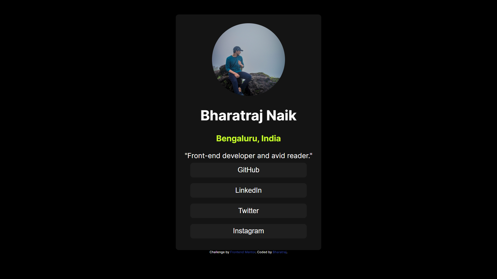

# Frontend Mentor - Social links profile solution

This is a solution to the [Social links profile challenge on Frontend Mentor](https://www.frontendmentor.io/challenges/social-links-profile-UG32l9m6dQ). Frontend Mentor challenges help you improve your coding skills by building realistic projects. 

## Overview

### The challenge

Users should be able to:

- See hover and focus states for all interactive elements on the page

### Screenshot

### Links
- Live Site URL:"https://zonan219.github.io/social-links-profile-main/"

### Built with

- Semantic HTML5 markup
- CSS custom properties

- Frontend Mentor - "https://www.frontendmentor.io/profile/zonan219"
- Twitter/X -" https://x.com/Bharatraj_Naik"

